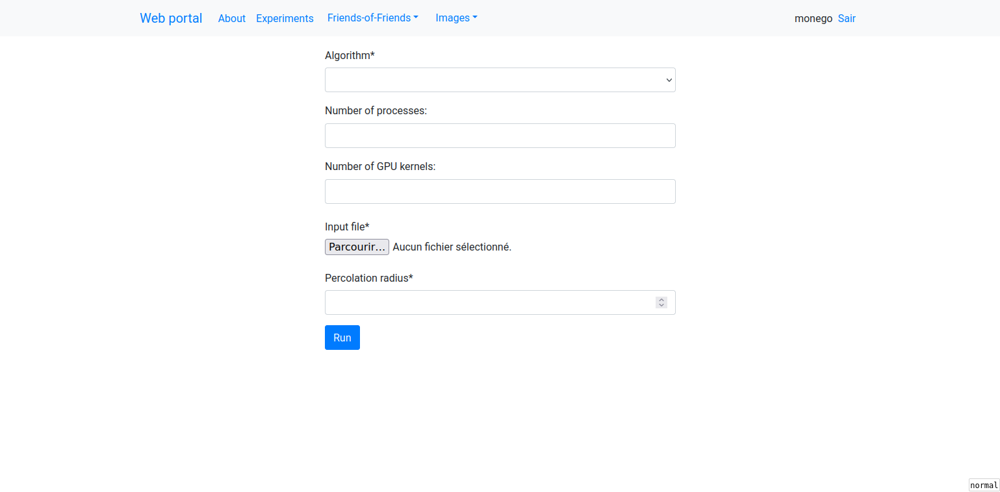
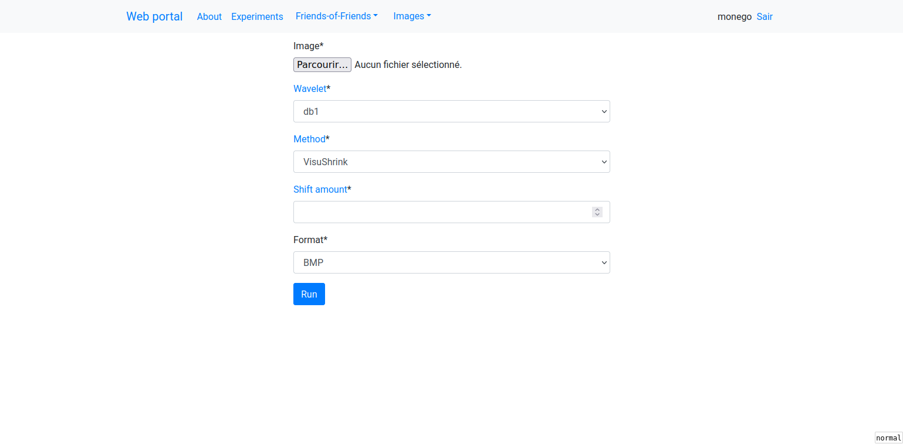

# WebVO





Development of the project:\
"Web Platform for Experiments with the Friends-of-Friends Hybrid Parallel Algorithm for Astronomical Objects Classification"\
\
Original application developed by Otávio Madalosso: https://github.com/Madalosso/TG/tree/master/Django%20Proj/webfriends 

## Running Local

1. Install [Poetry](https://python-poetry.org/).
2. In the root directory of this repository, install the requirements with `$ poetry install`.
3. Install redis-server (e.g. `# apt install redis-server`)
4. Start the applications:

``` bash 
$ redis-server # Start the Redis server
$ poetry run ./manage.py runserver # Start the Django app
$ poetry run celery -A webfriends worker --loglevel=DEBUG # Start the Celery worker
```

Finally, open http://localhost:8000 in a graphical web browser.

- **Attention!** Changes are needed in settings, experiments and tasks files.
